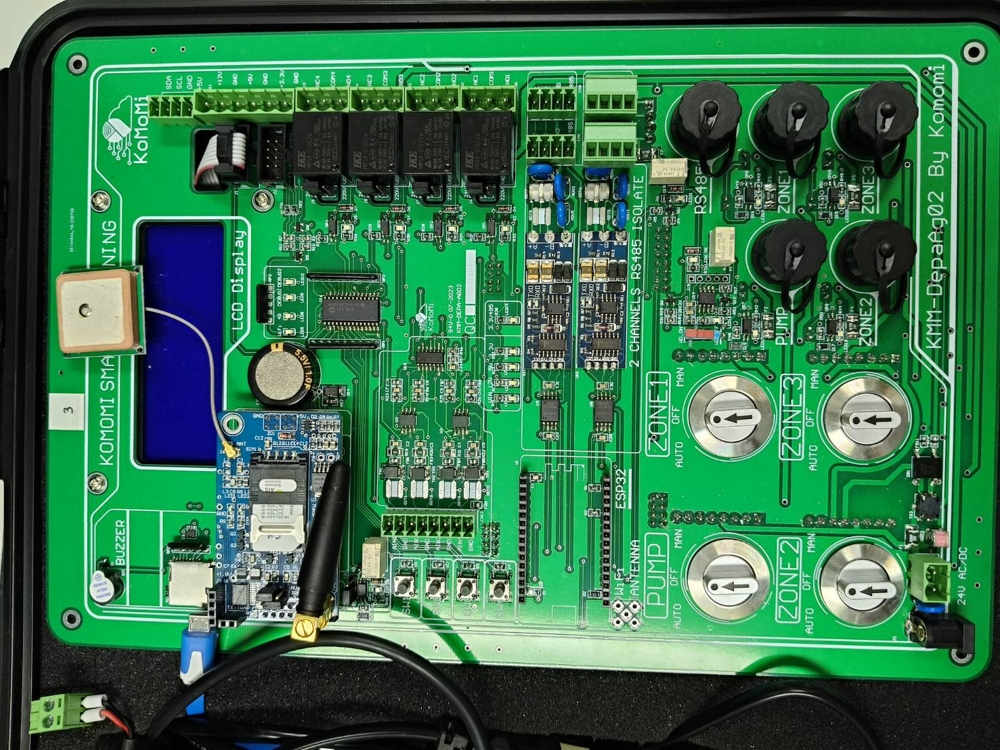
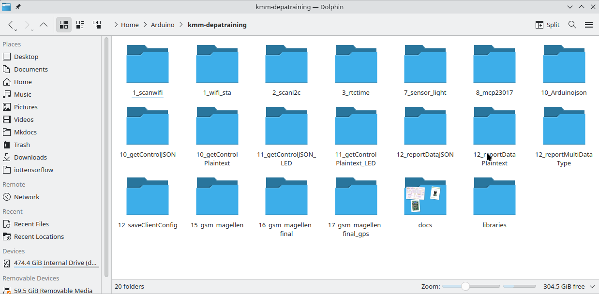
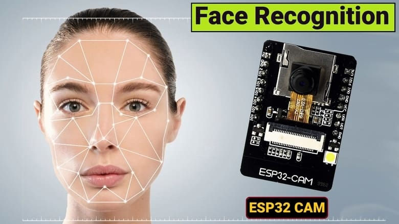
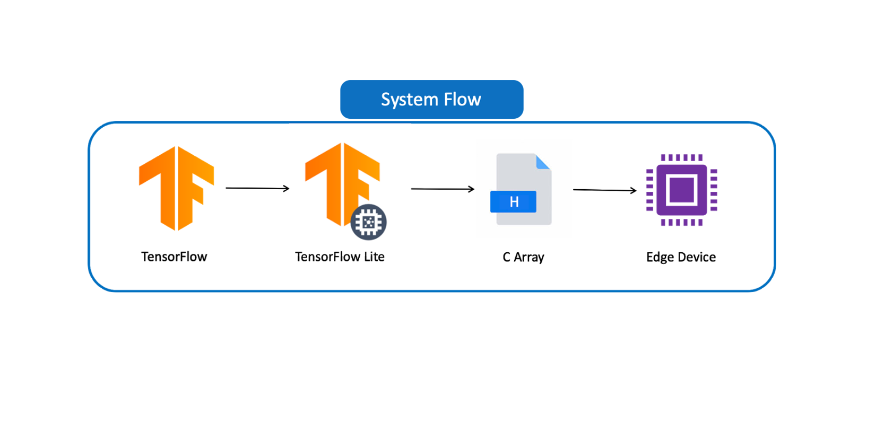

# Intruduction Machine Learning On Edge Computing

## Course:

### <u>Day1: part1 ESP32</u>

- Arduino IDE Setup
- PlatformIO IDE Setup
- ESP 32 Core Library
- C/C++ IoT Development

### <u>Day1: Part2 Develop Traning kit</u>

- ESP32 iot development on komomi Board

### <u>Day2: Part1 ESP32 Cam Project</u>

- ESP32-Cam พร้อมกล้อง OV2640
- Face Detaction
- Save Image to SD Card
- Send Image to Google

### <u>Day2: Part2 Tensorflow machine learning ESP32</u>

[EloquentTinyML](https://github.com/eloquentarduino/EloquentTinyML)

- Machine Learning
- Data Prediction
- more..
