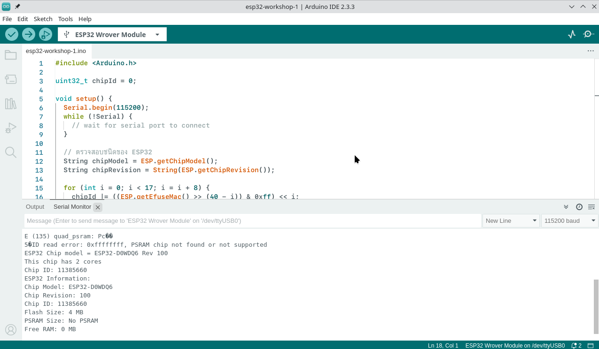
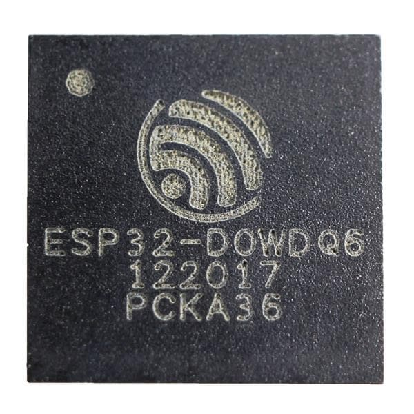
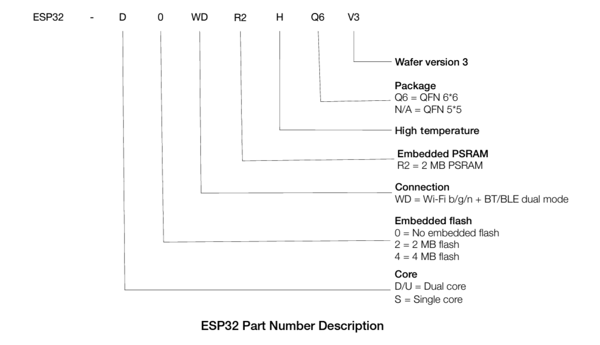
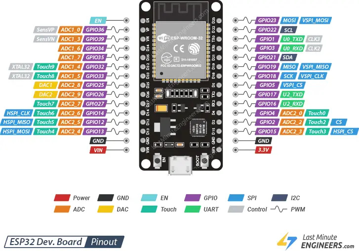

# 1 Esp 32 รุ่นต่าง

ตารางเปรียบเทียบความแตกต่างของ ESP32 ในรุ่นต่าง ๆ

# สรุป ESP32 รุ่นต่าง ๆ

## 1. ESP32-WROOM-32

- ชิป ESP32 รองรับ Wi-Fi และ Bluetooth (ทั้ง Classic และ BLE)
- มี GPIO 34 พิน, ADC, DAC, SPI, I2C, UART
- รองรับการทำงานหลายงานพร้อมกัน (dual-core)
- ใช้งานทั่วไปได้ดีในโปรเจค IoT

## 2. ESP32-WROOM-32U

- เหมือนกับ WROOM-32 แต่มีเสาอากาศภายนอกที่สามารถถอดเปลี่ยนได้
- เหมาะสำหรับโปรเจคที่ต้องการสัญญาณ Wi-Fi ที่เสถียรยิ่งขึ้น

## 3. ESP32-WROVER

- มีฟีเจอร์เดียวกับ WROOM-32 แต่มี RAM ขนาด 4MB เพิ่มเติม
- เหมาะกับการใช้งานที่ต้องการหน่วยความจำมากขึ้น เช่น การประมวลผลภาพ

## 4. ESP32-S2

- CPU แบบ single-core รองรับ Wi-Fi แต่ไม่รองรับ Bluetooth
- ฟีเจอร์อื่น ๆ เช่น USB OTG, รองรับความเร็วสูงในการเชื่อมต่อ
- เหมาะสำหรับโปรเจคที่ไม่ต้องการ Bluetooth และต้องการราคาถูกและประหยัดพลังงาน

## 5. ESP32-C3

- ใช้ CPU แบบ RISC-V และรองรับ Wi-Fi และ Bluetooth Low Energy (BLE)
- เป็นรุ่นที่ประหยัดพลังงาน และราคาถูก
- เหมาะสำหรับ IoT ที่ต้องการประสิทธิภาพในการประมวลผลที่ต่ำ

## 6. ESP32-S3

- รุ่นใหม่ที่รองรับ AI acceleration สำหรับการประมวลผล Machine Learning
- มีทั้ง Wi-Fi และ Bluetooth BLE
- รองรับการประมวลผลด้วย neural network สำหรับโปรเจคที่ต้องการการเรียนรู้ของเครื่อง

# ESP32 Variants

| **Variant**          | **Package** | **Pins** | **Embedded SPI Flash** | **Embedded SPI PSRAM** |
| -------------------- | ----------- | -------- | ---------------------- | ---------------------- |
| **ESP32-D0WD-V3**    | QFN 5x5 mm² | 48       | -                      | -                      |
| **ESP32-D0WDR2-V3**  | QFN 5x5 mm² | 48       | -                      | 2MB                    |
| **ESP32-U4WDH**      | QFN 5x5 mm² | 48       | 4MB                    | -                      |
| **ESP32-PICO-V3**    | LGA 7x7 mm² | 48       | 4MB                    | -                      |
| **ESP32-PICO-V3-02** | LGA 7x7 mm² | 48       | 8MB                    | 2MB                    |
| **ESP32-PICO-D4**    | LGA 7x7 mm² | 48       | 4MB                    | -                      |

```c title="esp32-workshop-1"  linenums="1"
#include <Arduino.h>

uint32_t chipId = 0;

void setup() {
  Serial.begin(115200);
  while (!Serial) {
    // wait for serial port to connect
  }

  // ตรวจสอบชนิดของ ESP32
  String chipModel = ESP.getChipModel();
  String chipRevision = String(ESP.getChipRevision());

  for (int i = 0; i < 17; i = i + 8) {
    chipId |= ((ESP.getEfuseMac() >> (40 - i)) & 0xff) << i;
  }

  Serial.printf("ESP32 Chip model = %s Rev %d\n", ESP.getChipModel(), ESP.getChipRevision());
  Serial.printf("This chip has %d cores\n", ESP.getChipCores());
  Serial.print("Chip ID: ");
  Serial.println(chipId);

  // ขนาดของ Flash Memory
  unsigned long flashSize = ESP.getFlashChipSize(); // Flash size in bytes
  unsigned long flashSizeKB = flashSize / 1024; // Convert to KB
  unsigned long flashSizeMB = flashSize / (1024 * 1024); // Convert to MB

  // ขนาดของ PSRAM (ถ้ามี)
  unsigned long psramSize = ESP.getPsramSize(); // PSRAM size in bytes
  unsigned long psramSizeKB = psramSize / 1024; // Convert to KB
  unsigned long psramSizeMB = psramSize / (1024 * 1024); // Convert to MB

  // ขนาดของ RAM
  unsigned long ramSize = ESP.getFreeHeap(); // Free RAM in bytes
  unsigned long ramSizeKB = ramSize / 1024; // Convert to KB
  unsigned long ramSizeMB = ramSize / (1024 * 1024); // Convert to MB

  // แสดงข้อมูลใน Serial Monitor
  Serial.println("ESP32 Information:");
  Serial.print("Chip Model: ");
  Serial.println(chipModel);
  Serial.print("Chip Revision: ");
  Serial.println(chipRevision);
  Serial.print("Chip ID: ");
  Serial.println(chipId);
  Serial.print("Flash Size: ");
  Serial.print(flashSizeMB);
  Serial.println(" MB");
  Serial.print("PSRAM Size: ");
  if (psramSize > 0) {
    Serial.print(psramSizeMB);
    Serial.println(" MB");
  } else {
    Serial.println("No PSRAM");
  }
  Serial.print("Free RAM: ");
  Serial.print(ramSizeMB);
  Serial.println(" MB");
}

void loop() {
  // ไม่มีการทำงานใน loop
}
```

**รายละเอียด:**

- **ESP.getChipModel() :** ใช้เพื่อดึงข้อมูลรุ่นของ ESP32
- **ESP.getFlashChipSize() :** ใช้เพื่อดึงขนาดของ Flash memory
- **ESP.getPsramSize() :** ใช้เพื่อดึงขนาดของ PSRAM (ถ้ามี)
- **ESP.getFreeHeap() :** ใช้เพื่อดึงขนาด RAM ที่ยังว่างอยู่

เมื่อโปรแกรมนี้รันบน ESP32 คุณจะเห็นข้อมูลเช่น รุ่นของชิป ขนาด Flash, PSRAM และ RAM ที่ยังเหลืออยู่ใน Serial Monitor.

**ผลลัพท์ที่ได้**



```bash
ESP32 Chip model = ESP32-D0WDQ6 Rev 100
This chip has 2 cores
Chip ID: 11385660
ESP32 Information:
Chip Model: ESP32-D0WDQ6
Chip Revision: 100
Chip ID: 11385660
Flash Size: 4 MB
PSRAM Size: No PSRAM
Free RAM: 0 MB
```





Pin out

