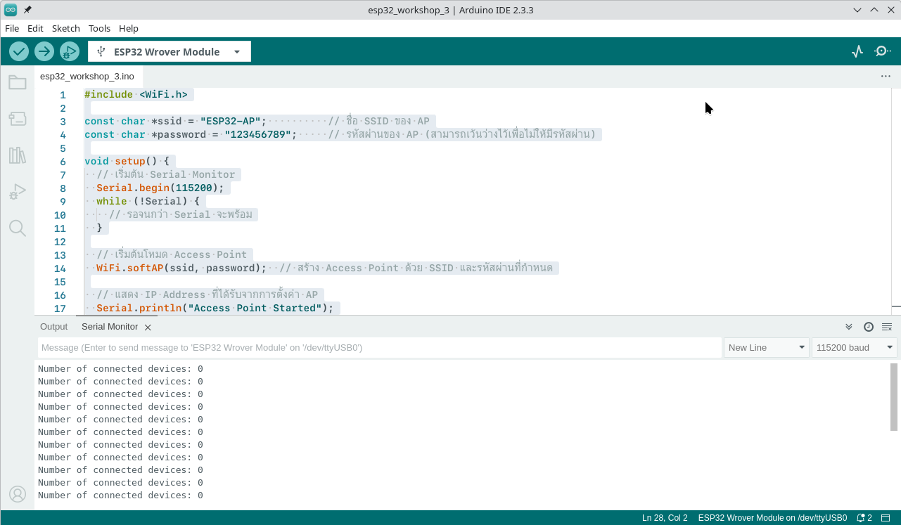

# 3 ESP32 AP Mode

ESP32 โหมด AP หมายถึงการตั้งค่าให้โมดูล ESP32 ทำหน้าที่เป็น จุดเชื่อมต่อ Wi-Fi (Access Point) เหมือนเราเตอร์ขนาดเล็ก โดย ESP32 จะปล่อยสัญญาณ Wi-Fi ออกมาเอง เพื่อให้อุปกรณ์อื่นๆ เช่น สมาร์ทโฟน, แท็บเล็ต หรืออุปกรณ์ IoT อื่นๆ สามารถเชื่อมต่อเข้ามาได้โดยตรง

```c title="esp32-workshop-3.ino"  linenums="1"
#include <WiFi.h>

const char *ssid = "ESP32-AP";          // ชื่อ SSID ของ AP
const char *password = "123456789";     // รหัสผ่านของ AP (สามารถเว้นว่างไว้เพื่อไม่ให้มีรหัสผ่าน)

void setup() {
  // เริ่มต้น Serial Monitor
  Serial.begin(115200);
  while (!Serial) {
    // รอจนกว่า Serial จะพร้อม
  }

  // เริ่มต้นโหมด Access Point
  WiFi.softAP(ssid, password);  // สร้าง Access Point ด้วย SSID และรหัสผ่านที่กำหนด

  // แสดง IP Address ที่ได้รับจากการตั้งค่า AP
  Serial.println("Access Point Started");
  Serial.print("IP Address: ");
  Serial.println(WiFi.softAPIP());  // แสดง IP Address ของ AP
}

void loop() {
  // สามารถตรวจสอบจำนวนผู้ใช้งานที่เชื่อมต่อกับ AP ได้
  Serial.print("Number of connected devices: ");
  Serial.println(WiFi.softAPgetStationNum());  // จำนวนอุปกรณ์ที่เชื่อมต่อ

  delay(5000);  // หยุดพัก 5 วินาที
}
```


