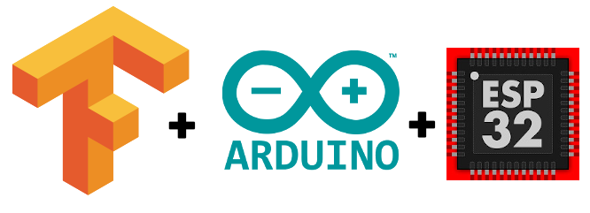

# 5 tensorflow lite ESP32



## EloquentTinyML

เป็นไลบรารีสำหรับพัฒนาและปรับใช้โมเดลแมชชีนเลิร์นนิงขนาดเล็กบนไมโครคอนโทรลเลอร์ เช่น ESP32 และ Arduino โดยเน้นความเรียบง่ายและประสิทธิภาพในการใช้งาน TinyML (Machine Learning ขนาดเล็ก) สำหรับงาน IoT และ embedded systems

**คุณสมบัติเด่นของ EloquentTinyML**

1. รองรับ TensorFlow Lite for Microcontrollers (TFLM):
   - ใช้ร่วมกับโมเดล TFLM ได้อย่างมีประสิทธิภาพ
   - รองรับการโหลดโมเดล .tflite แบบง่ายดาย
2. ใช้งานง่าย:
   - ออกแบบมาให้ผู้ใช้ที่ไม่มีพื้นฐานการเขียนโค้ด AI/ML ใช้งานได้สะดวก
   - มี API ที่กระชับสำหรับโหลดและทำนายผล (inference)
3. รองรับการประมวลผลสัญญาณ:
   - มีฟังก์ชัน preprocessing เช่น การกรองข้อมูล (filters) และการคำนวณคุณสมบัติ (feature extraction) สำหรับข้อมูลสัญญาณ เช่น เสียงหรือเซ็นเซอร์
4. การจัดการหน่วยความจำที่เหมาะสม: - ถูกออกแบบให้ทำงานในหน่วยความจำที่จำกัดของไมโครคอนโทรลเลอร์
   ใช้งานร่วมกับ Arduino IDE และแพลตฟอร์มอื่น:

5. ใช้กับ Arduino IDE หรือแพลตฟอร์มพัฒนาไมโครคอนโทรลเลอร์ได้ง่าย


[https://github.com/eloquentarduino/EloquentTinyML/tree/main/examples/IrisExample](https://github.com/eloquentarduino/EloquentTinyML/tree/main/examples/IrisExample)

# **กระบวนการใช้งาน EloquentTinyML โดยสรุป**

## 1. สร้างและเทรนโมเดลบนคอมพิวเตอร์

- ใช้แพลตฟอร์มเช่น TensorFlow หรือ scikit-learn ในการสร้างและเทรนโมเดล
- หากใช้ TensorFlow ให้แปลงโมเดลเป็น `.tflite` (TensorFlow Lite format)

```python
# ตัวอย่างการแปลงโมเดล TensorFlow เป็น .tflite
import tensorflow as tf

converter = tf.lite.TFLiteConverter.from_saved_model('model_path')
tflite_model = converter.convert()

with open('model.tflite', 'wb') as f:
    f.write(tflite_model)
```

## 2. แปลงโมเดล .tflite เป็นไฟล์ C++

- ใช้เครื่องมือเช่น xxd หรือ EloquentTinyML Model Converter เพื่อแปลงโมเดลเป็นโค้ด C++

```bash
xxd -i model.tflite > model.h

```

## 3 ติดตั้ง EloquentTinyML

- ดาวน์โหลดและติดตั้งไลบรารีผ่าน Arduino Library Manager หรือเพิ่มโดยตรงในโฟลเดอร์โปรเจกต์

## 4 เตรียมโค้ดบน Arduino IDE หรือ PlatformIO

- รวมไฟล์โมเดล (model.h) ในโปรเจกต์
- เขียนโค้ดสำหรับโหลดโมเดลและประมวลผลข้อมูล

## ตัวอย่าง Structure ของโปรแกรม

```c title="tensorflow_eloquenttinyml.h" linenums="1"
#include <EloquentTinyML.h>
#include "model.h"  // โมเดล .h ที่ได้จากการแปลงไฟล์ .tflite

#define FEATURE_SIZE 3  // จำนวนฟีเจอร์ที่โมเดลต้องการ
Eloquent::TinyML::TfLite<FEATURE_SIZE, 2> ml;  // ขนาดฟีเจอร์ และจำนวนคลาสผลลัพธ์

void setup() {
    Serial.begin(9600);
    ml.begin(model_data);  // โหลดโมเดล
}

void loop() {
    float input[FEATURE_SIZE] = {1.0, 2.0, 3.0};  // ตัวอย่างข้อมูลเข้า
    float prediction = ml.predictClass(input);   // ทำนายผลลัพธ์
    Serial.println(prediction);  // พิมพ์ผลลัพธ์
}

```

## Library ที่ใช้

- EloquentTinyML
  
- tflm_esp32
  
- tflm_cortexm
  

```c title="tensorflow_irismodel.h" linenums="1"

/**
 * Run a TensorFlow model to predict the IRIS dataset
 * For a complete guide, visit
 * https://eloquentarduino.com/tensorflow-lite-esp32
 */
// replace with your own model
// include BEFORE <eloquent_tinyml.h>!
#include "irisModel.h"
// include the runtime specific for your board
// either tflm_esp32 or tflm_cortexm
#include <tflm_esp32.h>
// now you can include the eloquent tinyml wrapper
#include <eloquent_tinyml.h>

// this is trial-and-error process
// when developing a new model, start with a high value
// (e.g. 10000), then decrease until the model stops
// working as expected
#define ARENA_SIZE 2000

Eloquent::TF::Sequential<TF_NUM_OPS, ARENA_SIZE> tf;

/**
 *
 */
void setup() {
    Serial.begin(115200);
    delay(3000);
    Serial.println("__TENSORFLOW IRIS__");

    // configure input/output
    // (not mandatory if you generated the .h model
    // using the everywhereml Python package)
    tf.setNumInputs(4);
    tf.setNumOutputs(3);
    // add required ops
    // (not mandatory if you generated the .h model
    // using the everywhereml Python package)
    tf.resolver.AddFullyConnected();
    tf.resolver.AddSoftmax();

    while (!tf.begin(irisModel).isOk())
        Serial.println(tf.exception.toString());
}


void loop() {
    // classify class 0
    if (!tf.predict(x0).isOk()) {
        Serial.println(tf.exception.toString());
        return;
    }

    Serial.print("expcted class 0, predicted class ");
    Serial.println(tf.classification);

    // classify class 1
    if (!tf.predict(x1).isOk()) {
        Serial.println(tf.exception.toString());
        return;
    }

    Serial.print("expcted class 1, predicted class ");
    Serial.println(tf.classification);

    // classify class 2
    if (!tf.predict(x2).isOk()) {
        Serial.println(tf.exception.toString());
        return;
    }

    Serial.print("expcted class 2, predicted class ");
    Serial.println(tf.classification);

    // how long does it take to run a single prediction?
    Serial.print("It takes ");
    Serial.print(tf.benchmark.microseconds());
    Serial.println("us for a single prediction");

    delay(1000);
}

```

## สรุปการทำงานของ code
