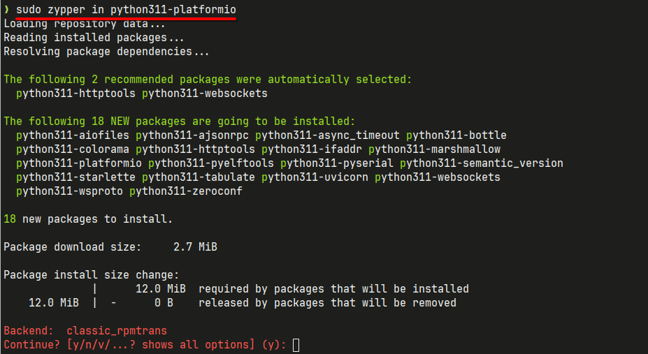
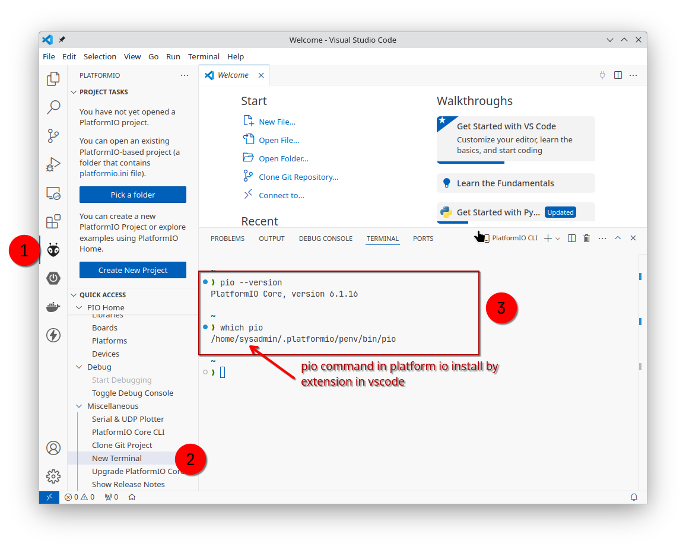
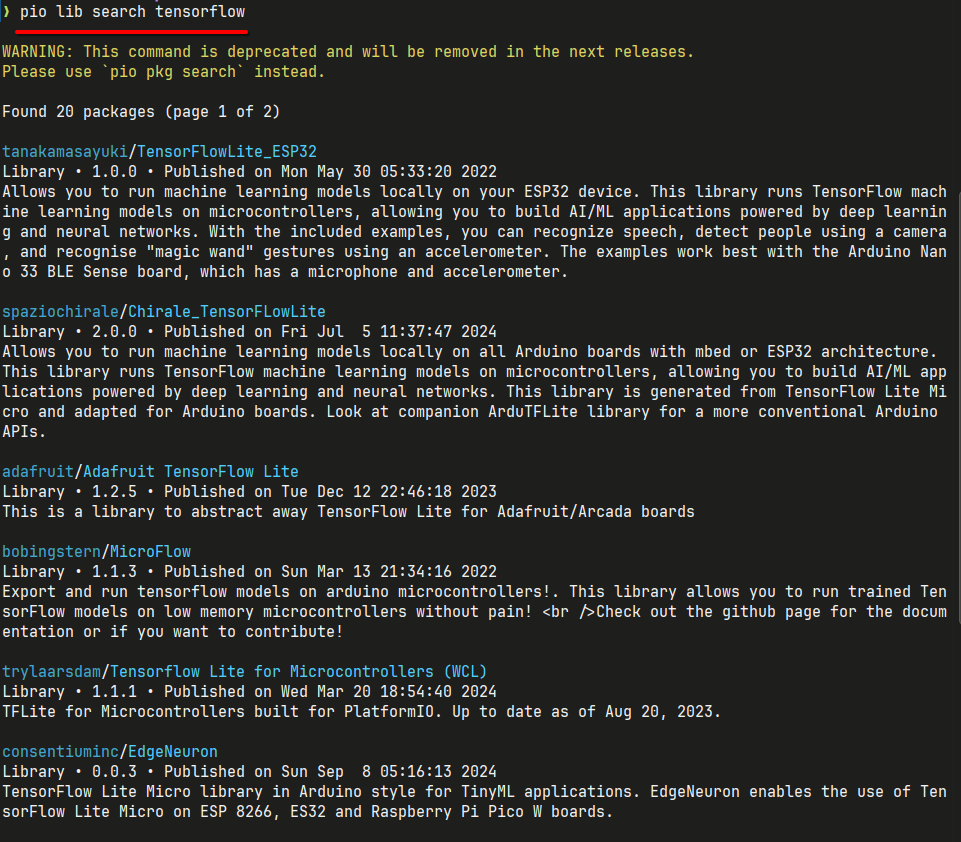
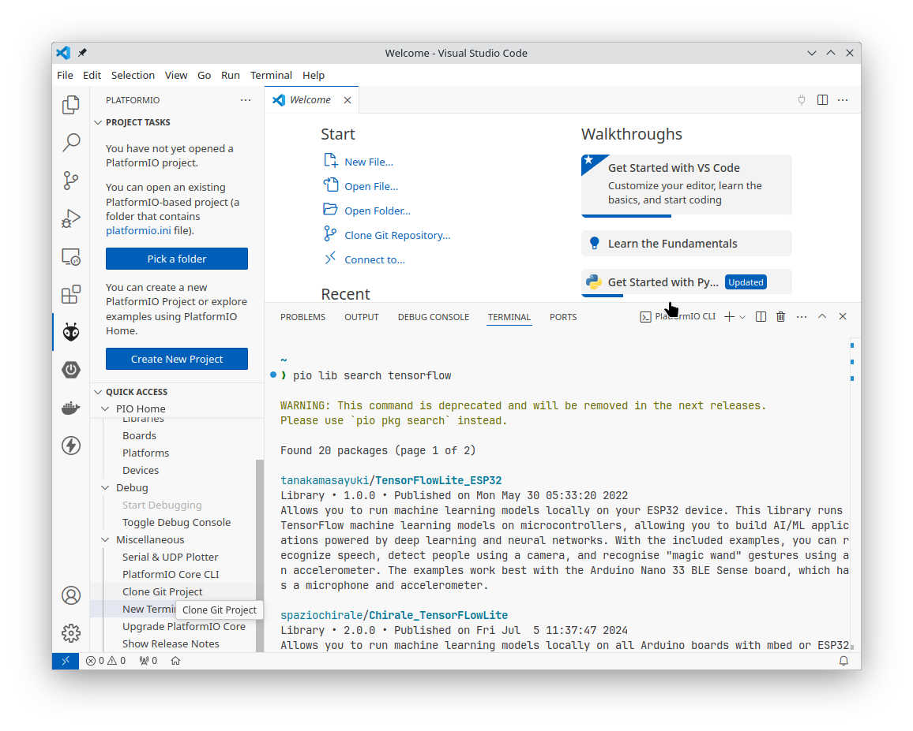

# install on linux (opensuse)

## install package

### installation by linx package

```bash
sudo zypper in python311-platformio
```



The pio command is part of PlatformIO Core and is installed via Python's package manager, pip. Ensure you have Python 3.6 or newer installed.

- verify installation

```bash title="package installation"
$ pip --version
PlatformIO Core, version 6.1.16

$ which pio
/usr/bin/pio
```

### Install via PlatformIO IDE (Integrated)

If you're using VS Code or another IDE with PlatformIO, the pio command is included.

**Steps:**

1. Install the PlatformIO IDE extension in your editor.
2. Open the PlatformIO terminal (look for the PlatformIO icon in your IDE).
3. Use the pio command directly from the terminal inside the IDE.



### Add pio to PATH (for linux/MacOS)

If the pio command isn't recognized, ensure it's in your system's PATH. Add the Python Scripts directory (or equivalent) to your environment's PATH.

```bash title="set environment"
export PATH=$PATH:~/.platformio/penv/bin

source ~/.bashrc
```

### Search library

```
pio lib search tensorflow
```

- Search tensorflow in terminal
  

- Search tensorflow in editor



### Tersorflow can that can use?

1. For ESP32 Exclusively:  
   Go with `tanakamasayuki/TensorFlowLite_ESP32`, as it is specifically tailored to the ESP32 architecture, making it lightweight and likely easier to set up.

2. For Long-Term Projects or Adafruit Ecosystem:  
   Choose `adafruit/Adafruit TensorFlow Lite` because it is actively maintained, supports more features, and benefits from regular updates. However, it might have extra abstractions or dependencies that are unnecessary for ESP32-specific projects.

- project structure

```bash title="project structure"
📁 MyTensorFlowProject
├── 📁 include
│   └── model.h (your TensorFlow Lite model header)
├── 📁 lib
│   └── (custom libraries, if any)
├── 📁 src
│   └── main.cpp (your main application code)
├── platformio.ini (PlatformIO configuration file)
└── 📁 test
    └── (optional test cases)
```

- example platformio.ini Configuration

```bash title="platformio.ini"
[env:esp32doit-devkit-v1]
platform = espressif32
board = esp32doit-devkit-v1
framework = arduino
lib_deps =
    adafruit/Adafruit TensorFlow Lite
monitor_speed = 115200
```

```c title="main.cpp

#include <Arduino.h>
#include "TensorFlowLite.h" // Adafruit TensorFlow Lite header

// Include TensorFlow Lite headers
#include "tensorflow/lite/micro/all_ops_resolver.h"
#include "tensorflow/lite/micro/micro_interpreter.h"
#include "tensorflow/lite/schema/schema_generated.h"
#include "tensorflow/lite/version.h"

// Include your TensorFlow Lite model as a byte array
#include "model.h"

// Memory for TensorFlow Lite
constexpr int tensor_arena_size = 10240; // Adjust size as needed
uint8_t tensor_arena[tensor_arena_size];

// TensorFlow Lite variables
tflite::MicroInterpreter* interpreter;
tflite::AllOpsResolver resolver;
TfLiteTensor* input;
TfLiteTensor* output;

void setup() {
    Serial.begin(115200);
    delay(1000); // Wait for Serial monitor
    Serial.println("Adafruit TensorFlow Lite Example!");

    // Load the TensorFlow Lite model
    const tflite::Model* model = tflite::GetModel(g_model);
    if (model->version() != TFLITE_SCHEMA_VERSION) {
        Serial.printf("Model schema version %d doesn't match supported version %d\n", model->version(), TFLITE_SCHEMA_VERSION);
        while (1);
    }

    // Create the TensorFlow Lite interpreter
    static tflite::MicroInterpreter static_interpreter(model, resolver, tensor_arena, tensor_arena_size, nullptr);
    interpreter = &static_interpreter;

    // Allocate tensors
    if (interpreter->AllocateTensors() != kTfLiteOk) {
        Serial.println("Failed to


```
