# 1 เรียนรู้การใช้ Board ESP32 WebCam

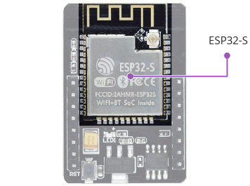

**โปรเซสเซอร์ ESP32-S**
SP32-S มีไมโครโปรเซสเซอร์ Tensilica Xtensa® LX6 พร้อมแกนประมวลผลแบบ 32 บิตจำนวนสองแกนที่ทำงานด้วยความเร็วสูงถึง 240 MHz! สิ่งนี้ทำให้ ESP32-S เหมาะสำหรับงานที่ต้องใช้พลังการประมวลผลสูง เช่น การประมวลผลวิดีโอ การจดจำใบหน้า และแม้กระทั่งปัญญาประดิษฐ์ (AI)

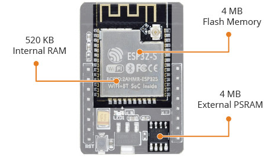

**หน่วยความจำ**
หน่วยความจำเป็นสิ่งสำคัญสำหรับงานที่ซับซ้อน ดังนั้น ESP32-S จึงมาพร้อม RAM ภายในขนาด 520 กิโลไบต์เต็ม ซึ่งอยู่บนชิปตัวเดียวกันกับส่วนประกอบอื่น ๆ ของชิปทั้งหมด
RAM ภายในอาจไม่เพียงพอสำหรับงานที่ต้องใช้ RAM มาก ดังนั้น ESP32-CAM จึงเพิ่ม PSRAM (Pseudo-Static RAM) ภายนอกขนาด 4 MB เพื่อขยายความจุหน่วยความจำ ซึ่งเพียงพออย่างมากสำหรับการประมวลผลเสียงหรือกราฟิกที่ต้องใช้พลังงานสูง

คุณสมบัติทั้งหมดนี้จะไร้ประโยชน์หากไม่มีพื้นที่เก็บข้อมูลเพียงพอสำหรับโปรแกรมและข้อมูล ESP32-S ได้รับการออกแบบมาให้โดดเด่นในจุดนี้ด้วยหน่วยความจำแฟลชบนชิปขนาด 4 MB

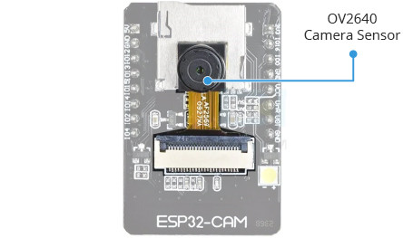
**กล้อง**
เซนเซอร์กล้อง OV2640 บน ESP32-CAM คือสิ่งที่ทำให้แตกต่างจากบอร์ดพัฒนา ESP32 รุ่นอื่น ๆ และเหมาะสำหรับโปรเจกต์วิดีโอ เช่น กริ่งประตูพร้อมกล้องหรือกล้องพี่เลี้ยงเด็ก

กล้อง OV2640 มีความละเอียด 2 เมกะพิกเซล ซึ่งให้ภาพที่มีความละเอียดสูงสุดถึง 1600×1200 พิกเซล เพียงพอสำหรับการใช้งานในระบบเฝ้าระวังส่วนใหญ่

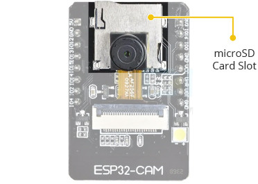

**การจัดเก็บข้อมูล**
การเพิ่มช่องเสียบการ์ด microSD บน ESP32-CAM ถือเป็นข้อดีเพิ่มเติม ช่วยให้สามารถขยายพื้นที่เก็บข้อมูลได้ไม่จำกัด ทำให้บอร์ดตัวนี้เหมาะอย่างยิ่งสำหรับการใช้งานเป็นตัวบันทึกข้อมูล (data logger) หรือการบันทึกภาพ

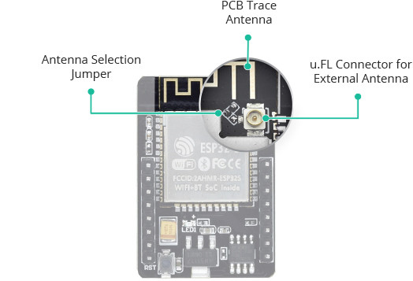

**เสาอากาศ**
ESP32-CAM มาพร้อมเสาอากาศแบบ PCB ที่ติดตั้งบนบอร์ดและขั้วต่อ u.FL สำหรับเชื่อมต่อกับเสาอากาศภายนอก นอกจากนี้ยังมีจัมเปอร์เลือกเสาอากาศ (ตัวต้านทาน 0 โอห์ม) ที่ช่วยให้คุณสามารถเลือกใช้งานระหว่างเสาอากาศทั้งสองแบบได้ตามต้องการ

**การใช้เสาอากาศภายนอก**
เสาอากาศ PCB เป็นวิธีที่ยอดเยี่ยมในการเริ่มต้นทดลองใช้งาน ESP32-CAM ซึ่งทำงานได้ดีหากคุณอยู่ใกล้กับเราเตอร์ (AI-Thinker ระบุว่าเสาอากาศ PCB มีการเพิ่มสัญญาณ 2.1dBi)

แต่หากคุณอยู่ห่างจากเราเตอร์เกินไป คุณอาจพบปัญหาการสตรีมวิดีโอที่ช้าและปัญหาการเชื่อมต่ออื่น ๆ ในกรณีนี้ ควรใช้เสาอากาศภายนอกขนาด 2.4GHz ที่มีขั้วต่อ IPX สำหรับการใช้งานนี้ คุณต้องปรับจัมเปอร์เสาอากาศเพื่อเปิดใช้งานขั้วต่อ u.FL

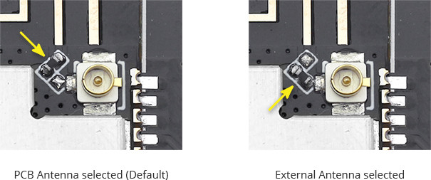

**Pinout สำหรับ board**

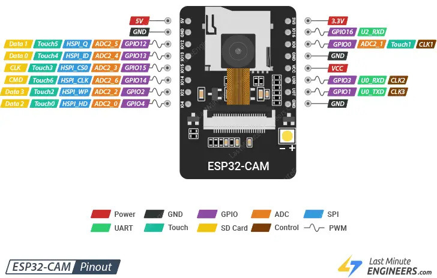

**LEDs**

ESP32-CAM มาพร้อมไฟ LED สีขาวทรงสี่เหลี่ยม ซึ่งออกแบบมาเพื่อใช้เป็นแฟลชของกล้อง แต่ยังสามารถใช้เป็นแสงสว่างทั่วไปได้เช่นกัน

นอกจากนี้ ยังมีไฟ LED สีแดงขนาดเล็กด้านหลังที่สามารถใช้เป็นตัวบ่งชี้สถานะ ไฟนี้สามารถตั้งโปรแกรมได้โดยผู้ใช้งาน และเชื่อมต่อกับขา GPIO33

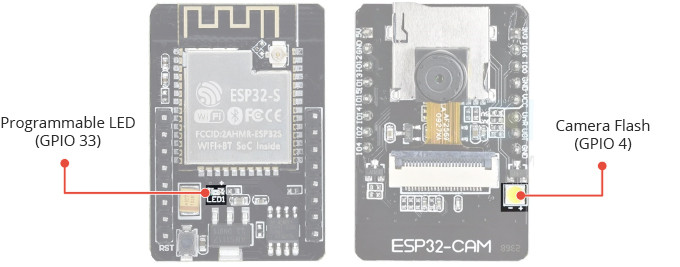

## การใช้งานอะแดปเตอร์ ESP32-CAM-MB (แนะนำ)

การใช้ FTDI Adapter เพื่อโปรแกรม ESP32-CAM อาจเป็นเรื่องยุ่งยากอยู่บ้าง ด้วยเหตุนี้ผู้จำหน่ายหลายรายจึงมีการขายบอร์ด ESP32-CAM พร้อมกับแผงเสริมขนาดเล็กที่เรียกว่า ESP32-CAM-MB

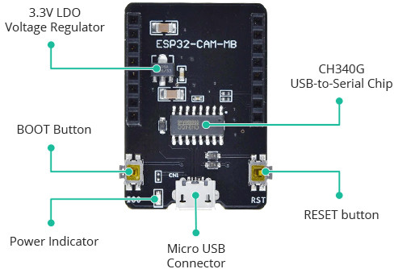

**คุณสมบัติเด่นของบอร์ดนี้**

จุดเด่นของบอร์ด ESP32-CAM-MB คือ CH340G USB-to-Serial Converter ซึ่งทำหน้าที่แปลงข้อมูลระหว่างคอมพิวเตอร์ของคุณกับ ESP32-CAM

นอกจากนี้ยังมีปุ่ม RESET, ปุ่ม BOOT, ไฟ LED แสดงสถานะพลังงาน และตัวควบคุมแรงดันไฟฟ้า (Voltage Regulator) เพื่อจ่ายพลังงานให้ ESP32-CAM อย่างเพียงพอ

## ตั้งค่า Board และ Partition ก่อนการ Burn

- ตั้งค่า Board ESP32 Wrover Module
  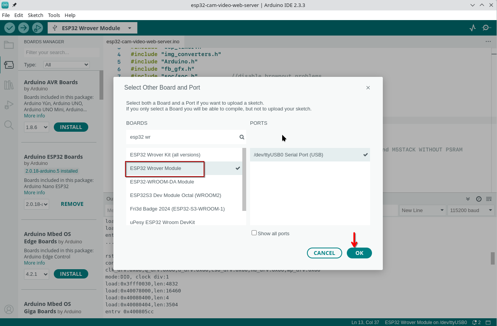
- ตั้งค่า partition Huge App
  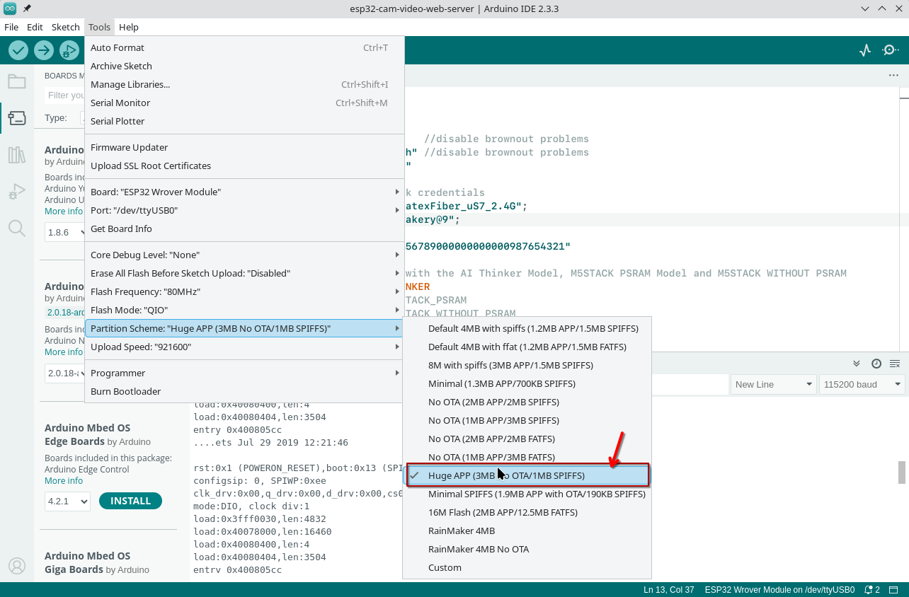

- การเชื่อมต่อ pin ของ esp32 และ กล้อง

  | ESP32 Pin | Camera Pin |
  | --------- | ---------- |
  | IO 0      | XCLK       |
  | IO 2      | PCLK       |
  | IO 15     | VSYNC      |
  | IO 13     | HREF       |
  | IO 12     | SIOC       |
  | IO 14     | SIOD       |
  | IO 5      | Y2         |
  | IO 18     | Y3         |
  | IO 19     | Y4         |
  | IO 21     | Y5         |
  | IO 22     | Y6         |
  | IO 23     | Y7         |
  | IO 25     | Y8         |
  | IO 26     | Y9         |

สรุป spec

**ESP32-CAM Specifications**

ESP32-CAM ใช้โมดูล ESP32-S เป็นพื้นฐาน ดังนั้นจึงมีสเปกที่เหมือนกัน โดยมีคุณสมบัติดังนี้:

- 802.11b/g/n Wi-Fi
- Bluetooth 4.2 with BLE
- UART, SPI, I2C and PWM interfaces
- Clock speed up to 160 MHz
- Computing power up to 600 DMIPS
- 520 KB SRAM plus 4 MB PSRAM
- Supports WiFi Image Upload
- Multiple Sleep modes
- Firmware Over the Air (FOTA) upgrades possible
- 9 GPIO ports
- Built-in Flash LED

```c title="esp32-cam-video-web-server.ino" linenums="1"
#include "esp_camera.h"
#include <WiFi.h>
#include "esp_timer.h"
#include "img_converters.h"
#include "Arduino.h"
#include "fb_gfx.h"
#include "soc/soc.h"          //disable brownout problems
#include "soc/rtc_cntl_reg.h" //disable brownout problems
#include "esp_http_server.h"

// Replace with your network credentials
const char *ssid = "TrueGigatexFiber_uS7_2.4G";
const char *password = "itbakery@9";

#define PART_BOUNDARY "123456789000000000000987654321"

// This project was tested with the AI Thinker Model, M5STACK PSRAM Model and M5STACK WITHOUT PSRAM
#define CAMERA_MODEL_AI_THINKER
// #define CAMERA_MODEL_M5STACK_PSRAM
// #define CAMERA_MODEL_M5STACK_WITHOUT_PSRAM

// Not tested with this model
// #define CAMERA_MODEL_WROVER_KIT

#if defined(CAMERA_MODEL_WROVER_KIT)
#define PWDN_GPIO_NUM -1
#define RESET_GPIO_NUM -1
#define XCLK_GPIO_NUM 21
#define SIOD_GPIO_NUM 26
#define SIOC_GPIO_NUM 27

#define Y9_GPIO_NUM 35
#define Y8_GPIO_NUM 34
#define Y7_GPIO_NUM 39
#define Y6_GPIO_NUM 36
#define Y5_GPIO_NUM 19
#define Y4_GPIO_NUM 18
#define Y3_GPIO_NUM 5
#define Y2_GPIO_NUM 4
#define VSYNC_GPIO_NUM 25
#define HREF_GPIO_NUM 23
#define PCLK_GPIO_NUM 22

#elif defined(CAMERA_MODEL_M5STACK_PSRAM)
#define PWDN_GPIO_NUM -1
#define RESET_GPIO_NUM 15
#define XCLK_GPIO_NUM 27
#define SIOD_GPIO_NUM 25
#define SIOC_GPIO_NUM 23

#define Y9_GPIO_NUM 19
#define Y8_GPIO_NUM 36
#define Y7_GPIO_NUM 18
#define Y6_GPIO_NUM 39
#define Y5_GPIO_NUM 5
#define Y4_GPIO_NUM 34
#define Y3_GPIO_NUM 35
#define Y2_GPIO_NUM 32
#define VSYNC_GPIO_NUM 22
#define HREF_GPIO_NUM 26
#define PCLK_GPIO_NUM 21

#elif defined(CAMERA_MODEL_M5STACK_WITHOUT_PSRAM)
#define PWDN_GPIO_NUM -1
#define RESET_GPIO_NUM 15
#define XCLK_GPIO_NUM 27
#define SIOD_GPIO_NUM 25
#define SIOC_GPIO_NUM 23

#define Y9_GPIO_NUM 19
#define Y8_GPIO_NUM 36
#define Y7_GPIO_NUM 18
#define Y6_GPIO_NUM 39
#define Y5_GPIO_NUM 5
#define Y4_GPIO_NUM 34
#define Y3_GPIO_NUM 35
#define Y2_GPIO_NUM 17
#define VSYNC_GPIO_NUM 22
#define HREF_GPIO_NUM 26
#define PCLK_GPIO_NUM 21

#elif defined(CAMERA_MODEL_AI_THINKER)
#define PWDN_GPIO_NUM 32
#define RESET_GPIO_NUM -1
#define XCLK_GPIO_NUM 0
#define SIOD_GPIO_NUM 26
#define SIOC_GPIO_NUM 27

#define Y9_GPIO_NUM 35
#define Y8_GPIO_NUM 34
#define Y7_GPIO_NUM 39
#define Y6_GPIO_NUM 36
#define Y5_GPIO_NUM 21
#define Y4_GPIO_NUM 19
#define Y3_GPIO_NUM 18
#define Y2_GPIO_NUM 5
#define VSYNC_GPIO_NUM 25
#define HREF_GPIO_NUM 23
#define PCLK_GPIO_NUM 22
#else
#error "Camera model not selected"
#endif

static const char *_STREAM_CONTENT_TYPE = "multipart/x-mixed-replace;boundary=" PART_BOUNDARY;
static const char *_STREAM_BOUNDARY = "\r\n--" PART_BOUNDARY "\r\n";
static const char *_STREAM_PART = "Content-Type: image/jpeg\r\nContent-Length: %u\r\n\r\n";

httpd_handle_t stream_httpd = NULL;

static esp_err_t stream_handler(httpd_req_t *req)
{
  camera_fb_t *fb = NULL;
  esp_err_t res = ESP_OK;
  size_t _jpg_buf_len = 0;
  uint8_t *_jpg_buf = NULL;
  char *part_buf[64];

  res = httpd_resp_set_type(req, _STREAM_CONTENT_TYPE);
  if (res != ESP_OK)
  {
    return res;
  }

  while (true)
  {
    fb = esp_camera_fb_get();
    if (!fb)
    {
      Serial.println("Camera capture failed");
      res = ESP_FAIL;
    }
    else
    {
      if (fb->width > 400)
      {
        if (fb->format != PIXFORMAT_JPEG)
        {
          bool jpeg_converted = frame2jpg(fb, 80, &_jpg_buf, &_jpg_buf_len);
          esp_camera_fb_return(fb);
          fb = NULL;
          if (!jpeg_converted)
          {
            Serial.println("JPEG compression failed");
            res = ESP_FAIL;
          }
        }
        else
        {
          _jpg_buf_len = fb->len;
          _jpg_buf = fb->buf;
        }
      }
    }
    if (res == ESP_OK)
    {
      size_t hlen = snprintf((char *)part_buf, 64, _STREAM_PART, _jpg_buf_len);
      res = httpd_resp_send_chunk(req, (const char *)part_buf, hlen);
    }
    if (res == ESP_OK)
    {
      res = httpd_resp_send_chunk(req, (const char *)_jpg_buf, _jpg_buf_len);
    }
    if (res == ESP_OK)
    {
      res = httpd_resp_send_chunk(req, _STREAM_BOUNDARY, strlen(_STREAM_BOUNDARY));
    }
    if (fb)
    {
      esp_camera_fb_return(fb);
      fb = NULL;
      _jpg_buf = NULL;
    }
    else if (_jpg_buf)
    {
      free(_jpg_buf);
      _jpg_buf = NULL;
    }
    if (res != ESP_OK)
    {
      break;
    }
    // Serial.printf("MJPG: %uB\n",(uint32_t)(_jpg_buf_len));
  }
  return res;
}

void startCameraServer()
{
  httpd_config_t config = HTTPD_DEFAULT_CONFIG();
  config.server_port = 80;

  httpd_uri_t index_uri = {
      .uri = "/",
      .method = HTTP_GET,
      .handler = stream_handler,
      .user_ctx = NULL};

  // Serial.printf("Starting web server on port: '%d'\n", config.server_port);
  if (httpd_start(&stream_httpd, &config) == ESP_OK)
  {
    httpd_register_uri_handler(stream_httpd, &index_uri);
  }
}

void setup()
{
  WRITE_PERI_REG(RTC_CNTL_BROWN_OUT_REG, 0); // disable brownout detector

  Serial.begin(115200);
  Serial.setDebugOutput(false);

  camera_config_t config;
  config.ledc_channel = LEDC_CHANNEL_0;
  config.ledc_timer = LEDC_TIMER_0;
  config.pin_d0 = Y2_GPIO_NUM;
  config.pin_d1 = Y3_GPIO_NUM;
  config.pin_d2 = Y4_GPIO_NUM;
  config.pin_d3 = Y5_GPIO_NUM;
  config.pin_d4 = Y6_GPIO_NUM;
  config.pin_d5 = Y7_GPIO_NUM;
  config.pin_d6 = Y8_GPIO_NUM;
  config.pin_d7 = Y9_GPIO_NUM;
  config.pin_xclk = XCLK_GPIO_NUM;
  config.pin_pclk = PCLK_GPIO_NUM;
  config.pin_vsync = VSYNC_GPIO_NUM;
  config.pin_href = HREF_GPIO_NUM;
  config.pin_sccb_sda = SIOD_GPIO_NUM;
  config.pin_sccb_scl = SIOC_GPIO_NUM;
  config.pin_pwdn = PWDN_GPIO_NUM;
  config.pin_reset = RESET_GPIO_NUM;
  config.xclk_freq_hz = 20000000;
  config.pixel_format = PIXFORMAT_JPEG;

  if (psramFound())
  {
    config.frame_size = FRAMESIZE_UXGA;
    config.jpeg_quality = 10;
    config.fb_count = 2;
  }
  else
  {
    config.frame_size = FRAMESIZE_SVGA;
    config.jpeg_quality = 12;
    config.fb_count = 1;
  }

  // Camera init
  esp_err_t err = esp_camera_init(&config);
  if (err != ESP_OK)
  {
    Serial.printf("Camera init failed with error 0x%x", err);
    return;
  }
  // Wi-Fi connection
  WiFi.begin(ssid, password);
  while (WiFi.status() != WL_CONNECTED)
  {
    delay(500);
    Serial.print(".");
  }
  Serial.println("");
  Serial.println("WiFi connected");

  Serial.print("Camera Stream Ready! Go to: http://");
  Serial.print(WiFi.localIP());

  // Start streaming web server
  startCameraServer();
}

void loop()
{
  delay(1);
}


```

- Outpot Esp จะทำการเชื่อมต่อกับ access point และได้ ip ให้เปิด browser ไปยัง ip ที่แสดง ใน console
  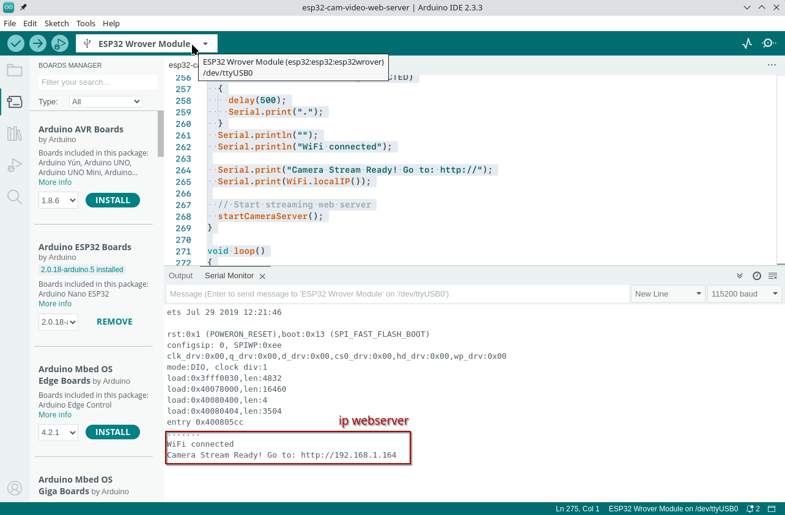
