# 5 TensorFlowlite Esp32

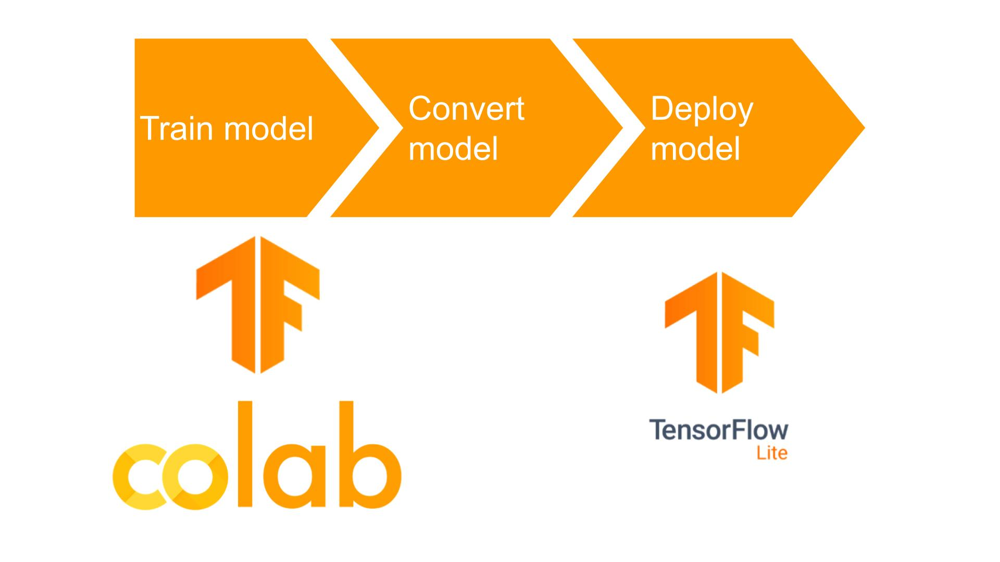

**อ้างอิง ทำตาม**
[https://colab.research.google.com/drive/1r0cgJ6ZK0vL811bKhF7DioA1se5TwQFa?usp=sharing](https://colab.research.google.com/drive/1r0cgJ6ZK0vL811bKhF7DioA1se5TwQFa?usp=sharing)

**เปิด file colab**

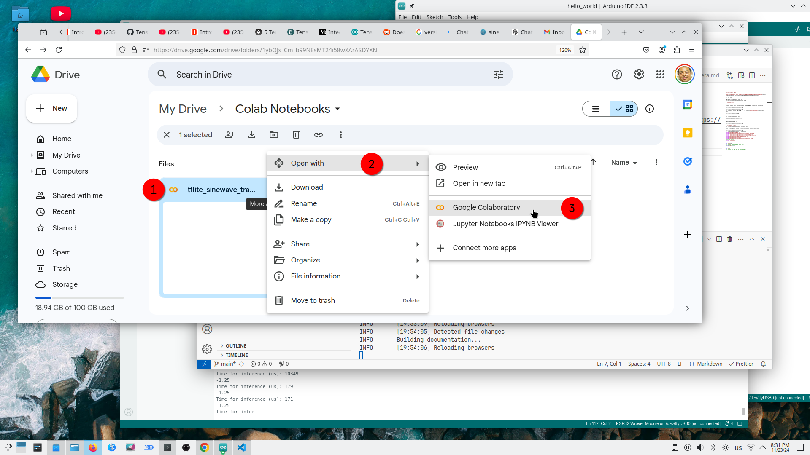

หรือสามารถสร้างไฟล์ colab ได้เช่นกัน
ไปยัง https://colab.research.google.com/
สร้าง new-project tflite-sinewave-training.ipynb

[https://gist.github.com/opendevbook/89be92082418aa046638beec58f2e723](https://gist.github.com/opendevbook/89be92082418aa046638beec58f2e723)

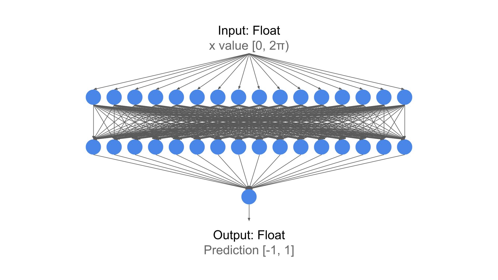

## sine_model.tflite

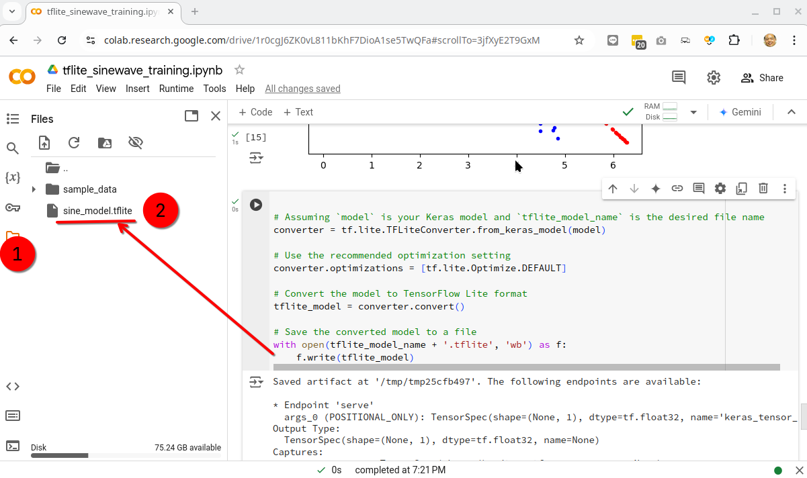

- jupyter notebook run in linux environment, ผลที่ได้จะอยู่ใน /content/sine_model.tflite

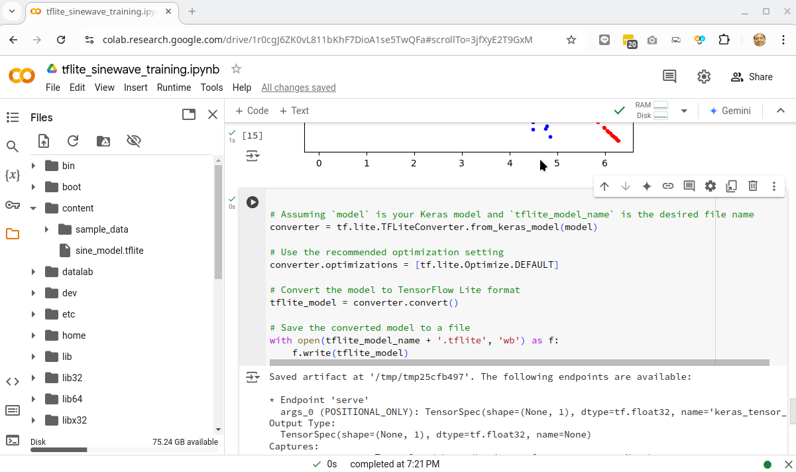

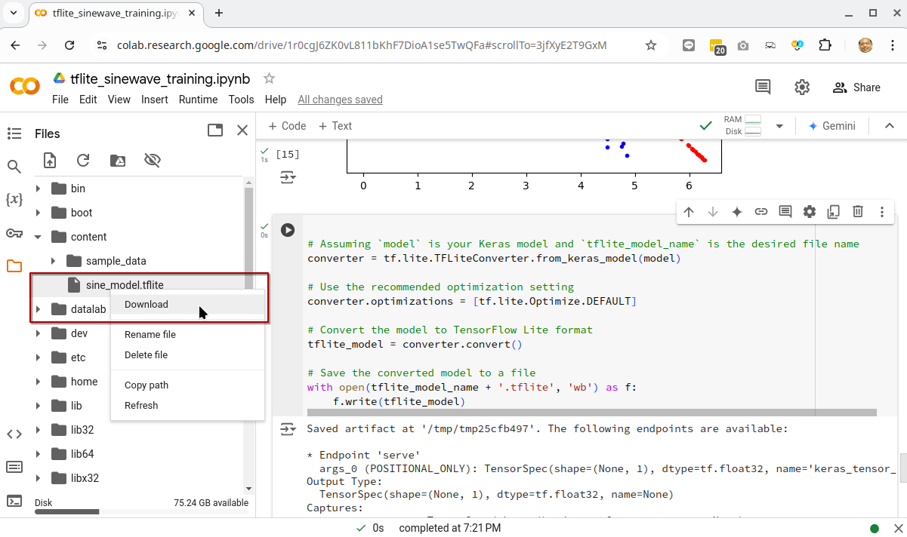

- กด Right Click Download มายังเครือง pc , เปิด browser [https://netron.app/](https://netron.app/)

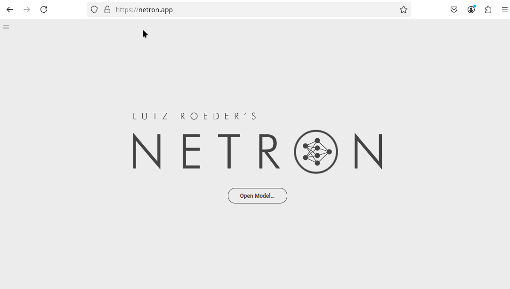

- เปิด โมเดลที่ได้มา จาก Colab

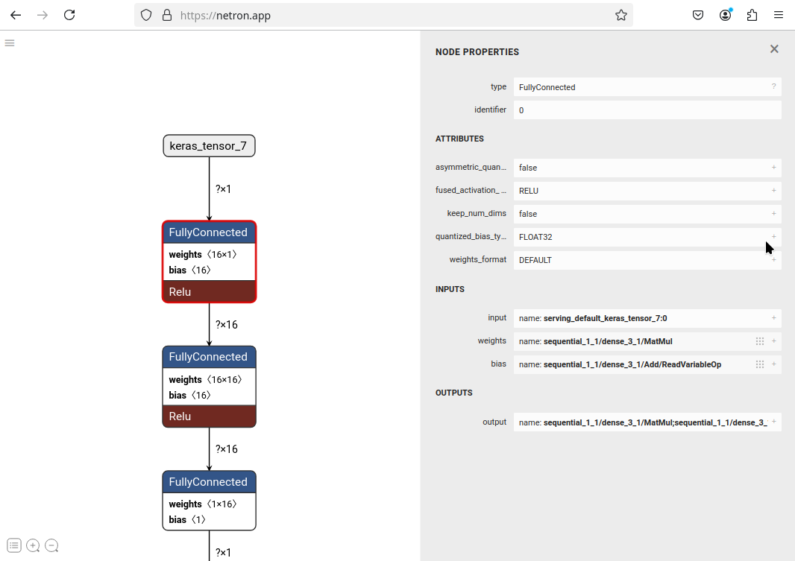

- Run ใน Colab ต่อสำหรับการ Covert file

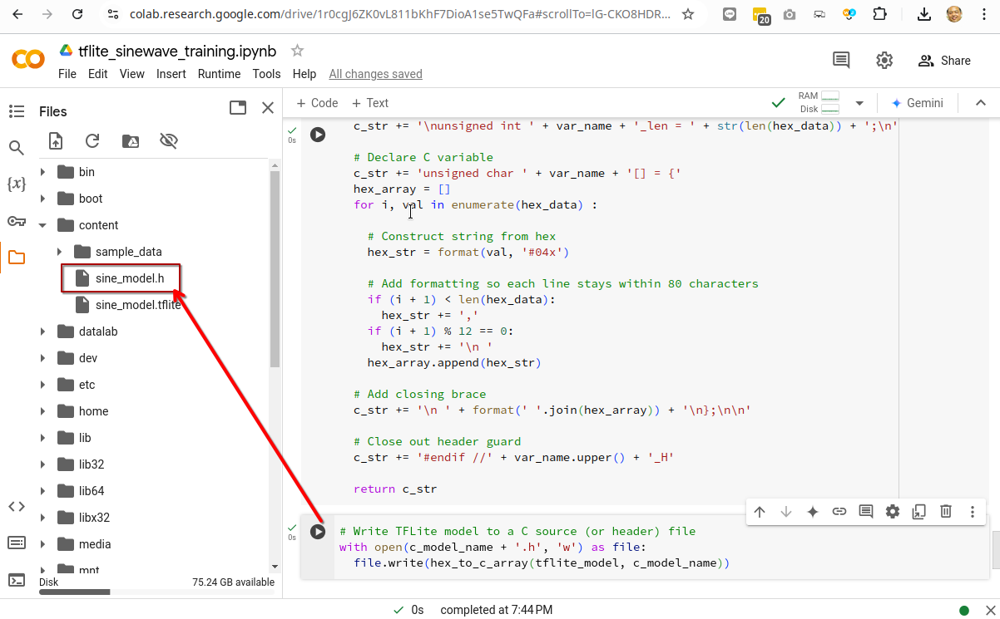

- Download h file มายัง pc

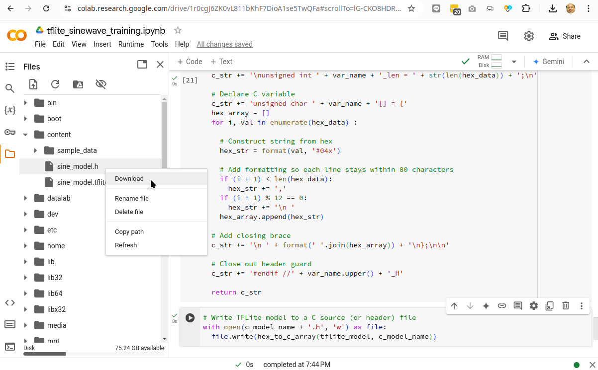

## Start Arduino project

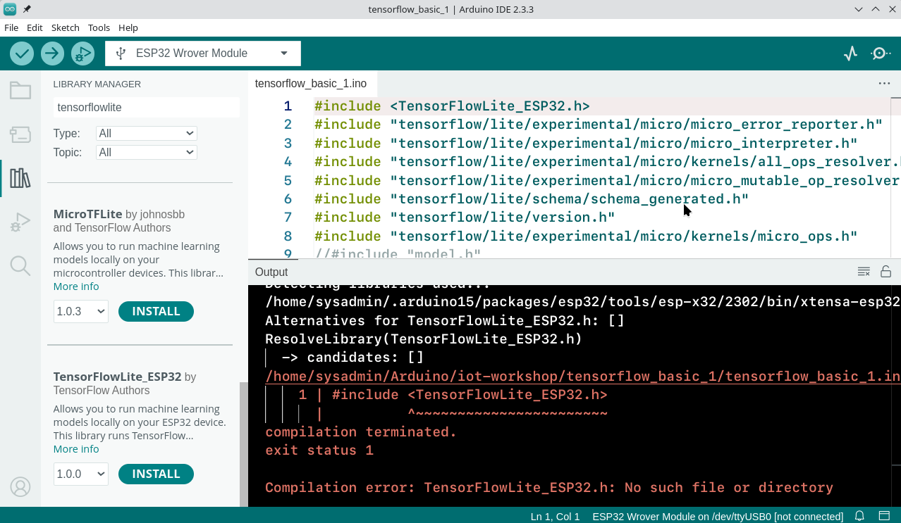

- สร้าง Arduino project และนำ โมเดลที่ได้ (sine_model.h) มาไว้ใน Arduino Project

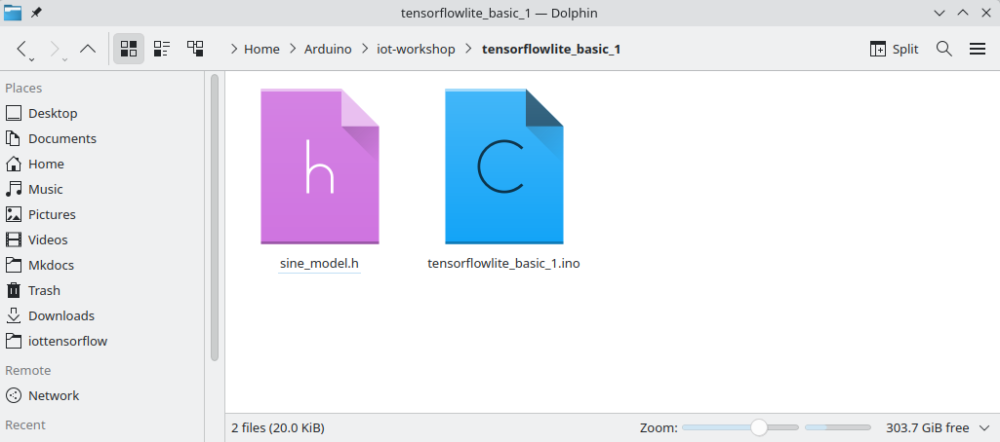

แนวคิดคือการฝึกโมเดลที่รับค่าเข้าระหว่าง 00 ถึง 2π2π และให้ผลลัพธ์เป็นค่าระหว่าง −1−1 ถึง 11 โดยถ้าเรากำหนดให้ค่าที่ป้อนเข้าเป็น xx และผลลัพธ์เป็น yy โมเดลควรสามารถทำนายค่า y=sin⁡(x)y=sin(x) ได้

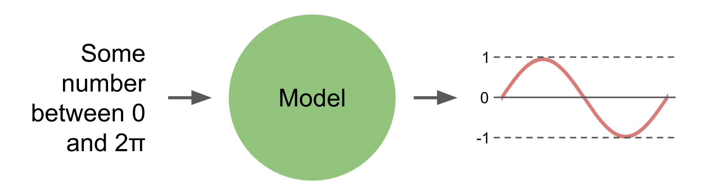

```c title="tenserflowlite_basic_1"  linenums="1"
#include <TensorFlowLite_ESP32.h>
#include "tensorflow/lite/micro/all_ops_resolver.h"
#include "tensorflow/lite/micro/micro_error_reporter.h"
#include "tensorflow/lite/micro/micro_interpreter.h"
#include "tensorflow/lite/micro/system_setup.h"
#include "tensorflow/lite/schema/schema_generated.h"

// Our model
#include "sine_model.h"

#define DEBUG 1

// Some settings
constexpr int led_pin = 2;
constexpr float pi = 3.14159265;                  // Some pi
constexpr float freq = 0.5;                       // Frequency (Hz) of sinewave
constexpr float period = (1 / freq) * (1000000);  // Period (microseconds)

// TFLite globals,
namespace {
tflite::ErrorReporter* error_reporter = nullptr;
const tflite::Model* model = nullptr;
tflite::MicroInterpreter* interpreter = nullptr;
TfLiteTensor* input = nullptr;
TfLiteTensor* output = nullptr;
int inference_count = 0;

// Crete area of memory use for input, output
// Estimate size start from 2 kilobyte (1 * 1024)
constexpr int kTensorArenaSize = 2 * 1024;
uint8_t tensor_arena[kTensorArenaSize];

}  // namespace

void setup() {
  // put your setup code here, to run once:
  Serial.begin(115200);


  // Set up logging. Google style is to avoid globals or statics because of
  // lifetime uncertainty, but since this has a trivial destructor it's okay.
  // NOLINTNEXTLINE(runtime-global-variables)
  static tflite::MicroErrorReporter micro_error_reporter;
  error_reporter = &micro_error_reporter;

  // Map the model into a usable data structure. This doesn't involve any
  // copying or parsing, it's a very lightweight operation.
  model = tflite::GetModel(sine_model);
  if (model->version() != TFLITE_SCHEMA_VERSION) {
    TF_LITE_REPORT_ERROR(error_reporter,
                         "Model provided is schema version %d not equal "
                         "to supported version %d.",
                         model->version(), TFLITE_SCHEMA_VERSION);
    return;
  }

  // This pulls in all the operation implementations we need.
  // NOLINTNEXTLINE(runtime-global-variables)
  static tflite::AllOpsResolver resolver;

  // Build an interpreter to run the model with.
  static tflite::MicroInterpreter static_interpreter(
    model, resolver, tensor_arena, kTensorArenaSize, error_reporter);
  interpreter = &static_interpreter;

  // Allocate memory from the tensor_arena for the model's tensors.
  TfLiteStatus allocate_status = interpreter->AllocateTensors();
  if (allocate_status != kTfLiteOk) {
    TF_LITE_REPORT_ERROR(error_reporter, "AllocateTensors() failed");
    return;
  }

  // Obtain pointers to the model's input and output tensors.
  input = interpreter->input(0);
  output = interpreter->output(0);

  // Keep track of how many inferences we have performed.
  inference_count = 0;
}

void loop() {
  // put your main code here, to run repeatedly:
#if DEBUG
  unsigned long start_timestamp = micros();
#endif

  // Get current timestamp and modulo with period
  unsigned long timestamp = micros();
  timestamp = timestamp % (unsigned long)period;

  // Calculate x value to feed to the model
  float x_val = ((float)timestamp * 2 * pi) / period;

  // Copy value to input buffer (tensor)
  input->data.f[0] = x_val;

  // Run inference
  TfLiteStatus invoke_status = interpreter->Invoke();
  if (invoke_status != kTfLiteOk) {
    error_reporter->Report("Invoke failed on input: %f\n", x_val);
  }

  // Read predicted y value from output buffer (tensor)
  float y_val = output->data.f[0];
  // Print value
  Serial.println(y_val);

#if DEBUG
  Serial.print("Time for inference (us): ");
  Serial.println(micros() - start_timestamp);
#endif
}


```

ให้ [Download code ได้ที่ file Google Drive](https://drive.google.com/file/d/1mjUU3XjI9CS-sy_AC9IAIMz2NwF31lcf/view?usp=sharing)
